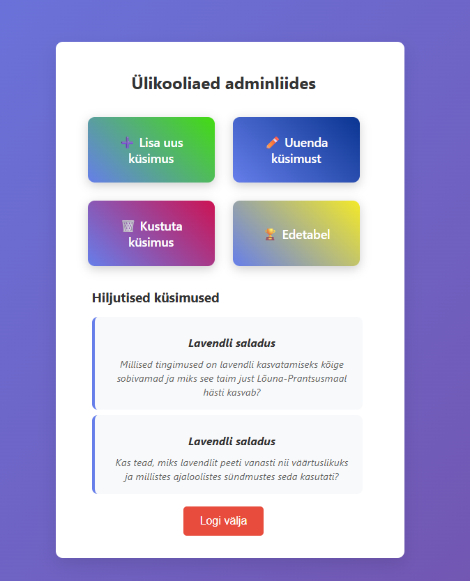

# ÜlikooliAed-Admin
Tegemist on admini liidesega Ülikooliaed mängule. 
Antud liideses on võimalik lisada, muuta, kustutada küsimusi ja vaadata mängijate edetabelit.

Rakenduse käivitamine lokaalselt:
Rakenduse käivituseks on vaja postgres andmebaasi ja nodejs.

Kontrolli node olemasolu: 
1)node --version  
2)npm --version

Installi sõltuvused logimiseks: 
1)npm install express bcrypt express-session pg  
2)npm install --save-dev nodemon

Lisa server.js enda postgre andmebaasi andmed.
Jooksuta DDL kaustas oled skriptid, et luua andmestruktuurid baasis.

Jooksuta server: npm start
